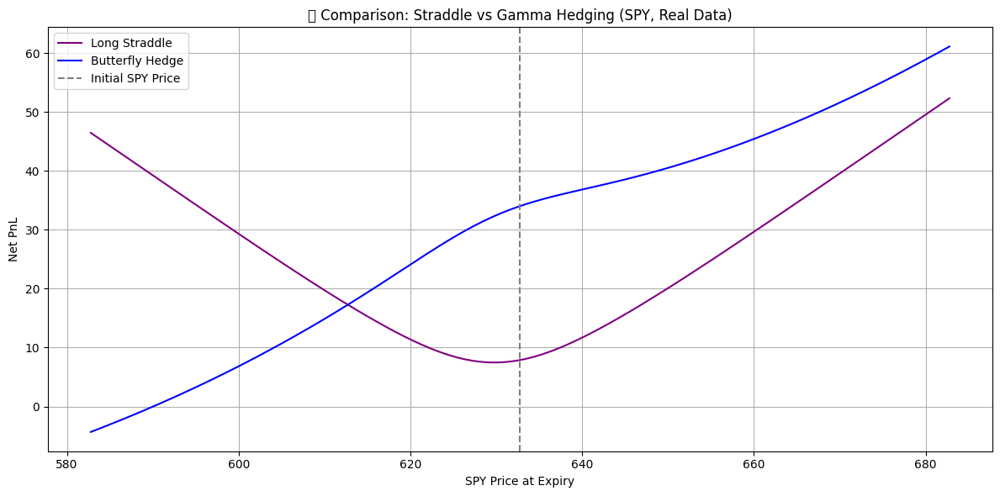

# Delta-Gamma Hedging Strategy with Real SPY Options Data

This project simulates and compares two volatility-based options strategies using real market data from SPY (S&P 500 ETF):

1. **Long Straddle Strategy** – A pure volatility bet, long call + long put at the same strike.
2. **Delta-Gamma Hedged Portfolio (Butterfly-style)** – A convex options strategy that is Delta-neutral but Gamma-exposed, constructed using real option chain data and Black-Scholes Greeks.

## What This Project Demonstrates

- How to fetch real SPY options data using `yfinance`
- How to calculate Delta and Gamma using the Black-Scholes model
- How to construct and simulate:
  - A Long Straddle
  - A Butterfly-style Delta-neutral, Gamma-positive portfolio
- How to visualize and compare the convexity and profit/loss behavior of both strategies

## Strategy Comparison

| Strategy              | PnL Shape   | Risk Profile           | When to Use                    |
|-----------------------|-------------|------------------------|--------------------------------|
| Long Straddle         | "V" shape   | High cost, high reward | Earnings, macro events         |
| Delta-Gamma Hedging   | Smooth curve| Moderate reward        | Low-volatility trending markets|

## Files

- `spy_delta_gamma_hedging.ipynb` – Notebook with data fetching, simulation, and plots
- `spy_calls_chain.csv` – Option chain snapshot (optional save)
- `requirements.txt` – Dependencies to run the project

## How to Run

1. Clone the repo
2. Install requirements:
   ```bash
   pip install -r requirements.txt
   ```
3. Run the notebook:
   ```bash
   jupyter notebook spy_delta_gamma_hedging.ipynb
   ```

## Example Output

The notebook generates the following comparison plot:




